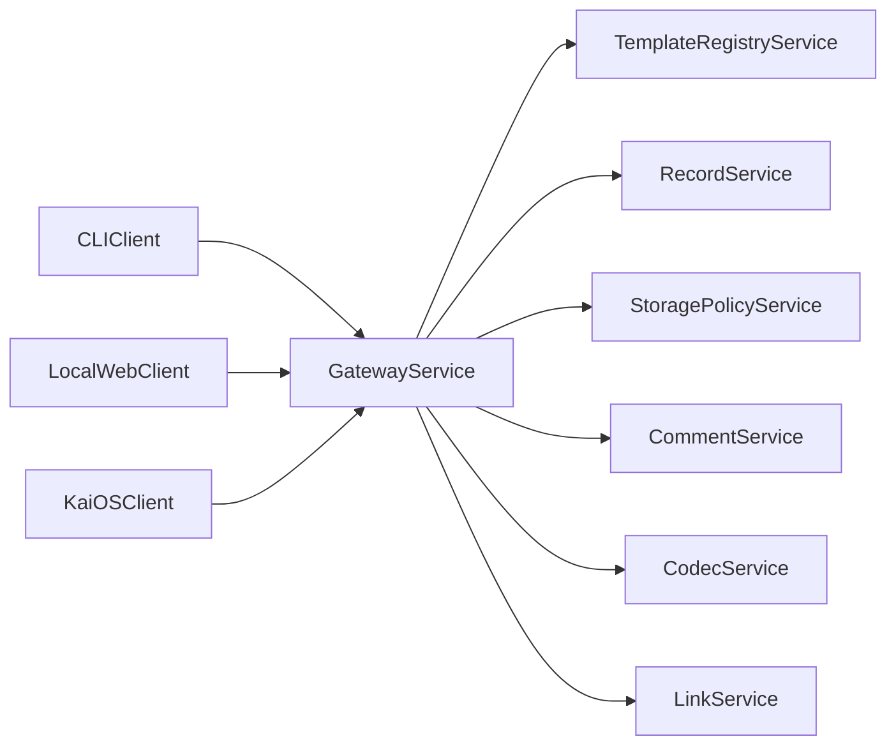

# Workpads

A simple product in a complex era.

Workpads is a job-record system built around one durable unit: the single work document.
Instead of forcing small teams into heavy software stacks, Workpads keeps the center of gravity on one thing that always matters in real work: a clear record of what happened, what should happen next, and why.

## Why This Exists

Most software for mobile businesses assumes:

- stable staffing,
- reliable desktop setup,
- always-on connectivity,
- willingness to manage accounts, seats, and subscriptions before work starts.

That assumption fails for many teams in trades, field service, and mobile operations.

Workpads starts from the opposite assumption:

- work starts in the field,
- teams are fluid,
- devices are constrained,
- connectivity is variable,
- simplicity is a hard requirement, not a nice-to-have.

The product thesis is straightforward:

1. The individual job record is the root unit of business coordination.
2. If job records are easy to create, share, and review, planning and performance improve.
3. If records can travel as tiny links, coordination becomes lightweight and resilient.

## The Core Model: PADS

Workpads uses a universal shape called **PADS**:

- **P**rocesses: the job and its structured fields.
- **A**ctions: step-by-step items (short, actionable instructions).
- **D**etails: concise notes and context.
- **S**tory: long-form narrative and reflection.

PADS is intentionally small. It is broad enough to model real jobs and simple enough to run on low-end mobile devices.

## Product Principles

### 1) Simplicity First

- Plain HTML/CSS/JS compatibility.
- Minimal moving parts.
- Optional complexity, never mandatory complexity.

### 2) Offline and Private by Default

- No account required for baseline operation.
- Local-first behavior.
- Ephemeral-friendly storage policies.

### 3) Shareability Without Friction

- Workpads can be encoded to compact URLs.
- A recipient can open the link and reconstruct the record.
- Size is observable and optimized.

### 4) Compatibility as a Strategy

- Start with constraints (KaiOS-class devices, small screens).
- Keep behavior consistent across CLI, browser, and future app shells.

### 5) Service Contracts Over Client Divergence

- One set of contracts.
- Many clients.
- Same data model everywhere.

## Who It Serves

Primary users:

- owner-operators in field businesses,
- dispatchers/team leads managing daily jobs,
- workers and collaborators who need access without full platform onboarding.

Core jobs-to-be-done:

- create a job record quickly,
- coordinate work with minimal friction,
- share context in one artifact,
- preserve learning from one job to improve the next.

## What “Good” Looks Like

A Workpads workflow should feel like:

- fast enough for in-field entry,
- clear enough for handoff,
- compact enough for lightweight sharing,
- structured enough for later reporting and improvement.

## Architecture Overview

Workpads uses a microservice contract model with thin clients.



### Service Responsibilities

- `gateway-service`: single orchestration entry point for clients.
- `template-registry-service`: validate, normalize, and resolve templates.
- `record-service`: create/edit/list/delete workpad records.
- `storage-policy-service`: business defaults + per-record storage override resolution.
- `comment-service`: social-mode comments and moderation actions.
- `codec-service`: encode/decode payloads.
- `link-service`: build/parse final links and centralize base URL control.

## 1:1 Client Strategy (CLI and Browser)

The CLI is not an experiment separate from the app; it is the first production client.

Design rule:

- if a workflow exists in browser, it must have a matching CLI contract,
- if a workflow exists in CLI, browser should consume the same request/response shape.

This keeps behavior stable while clients evolve.

Reference: `architecture/microservices-practice.md`

## Data Shapes

### Canonical Record (conceptual)

```json
{
  "templateId": "svc-basic",
  "variant": "plain",
  "process": {},
  "actions": [],
  "details": "",
  "story": "",
  "comments": []
}
```

### Compact Share Payload (conceptual)

```json
{
  "v": 1,
  "m": "legacy",
  "t": "svc-basic",
  "r": "plain",
  "f": {},
  "c": []
}
```

## Templates

Workpads supports dual authoring formats:

- simple KV (`templates/svc-basic.kv`)
- YAML (`templates/svc-basic.yaml`)

Both normalize to runtime schema JSON:

- `templates/runtime/svc-basic.v1.json`

This allows human-friendly editing while keeping runtime predictable and lightweight.

## Storage Model

Storage is policy-driven and explicit:

- business-level default mode,
- optional per-record override,
- effective policy resolved at write/edit time.

Modes:

- `ephemeral`
- `stored`

Reference: `protocol/storage-policy.md`

## Sharing Model

Workpad records can generate compact links for transport.

Current implementation focus:

- compact encoding and decode/import workflow,
- URL size visibility in list/dashboard metrics,
- no hard size enforcement yet (observability first).

## Social Mode

Two main variants are supported conceptually:

- `plain`: core PADS without social interaction.
- `social`: PADS + comments.

Social identity behavior is anonymous-first with optional display names.

## Current CLI Capabilities

The CLI currently supports:

- template validate/compile/show,
- create/edit/share/import,
- render/export/list/delete,
- storage policy get/set/resolve (`storage:*` and `policy:*` alias support),
- comment add/list/delete,
- size dashboard (`lowest`, `highest`, `average`).

Reference: `cli.md`

## BASICS Conformance Work (Started)

Workpads has begun strict BASICS conformance testing with a harsh-assessment posture.

Initial artifacts:

- `conformance-tests/README.md`
- `conformance-tests/basics-dirty-2026-04-20-workpads-cli.md`

Current result:

- implementation is strong,
- formal conformance evidence is incomplete,
- Core claim is currently blocked pending policy/evidence alignment.

## What Is Deliberately Paused

To protect simplicity and focus:

- legacy vs modern codec branching is paused,
- encryption is paused,
- strict size enforcement is paused.

These are intentionally deferred, not forgotten.

## Why This Approach Is Defensible

### Product Argument

- Small teams need fewer dependencies, not more.
- Work quality improves when records are portable and readable.
- A simple universal record model compounds value over time.

### Technical Argument

- Contract-first microservices reduce client divergence.
- Local-first model improves reliability under poor connectivity.
- Template normalization allows flexible authoring with stable runtime behavior.

### Operational Argument

- CLI-first development hardens contracts early.
- Browser/KaiOS can ship faster once behaviors are proven in CLI.
- Size dashboarding creates immediate feedback loops for payload discipline.

## Near-Term Roadmap

1. Keep templates production-grade and add more domain variants.
2. Continue hardening comment and storage workflows.
3. Bring local gateway service online so CLI/browser call identical APIs.
4. Build browser client as a strict 1:1 contract consumer.
5. Move to KaiOS-focused UI implementation on the same contracts.

## How To Start

From `repos/workpads`:

```bash
npm install
node ./workpads.js help
```

Then:

```bash
node ./workpads.js template:validate --file ./templates/svc-basic.kv --format kv
node ./workpads.js create --template svc-basic --variant plain --set process.job="Replace faucet"
node ./workpads.js share --record loc_000001
```

For full command examples, see `cli.md`.

---

Workpads is built on a simple conviction:

If the record is right, the rest of the system can be built cleanly around it.
