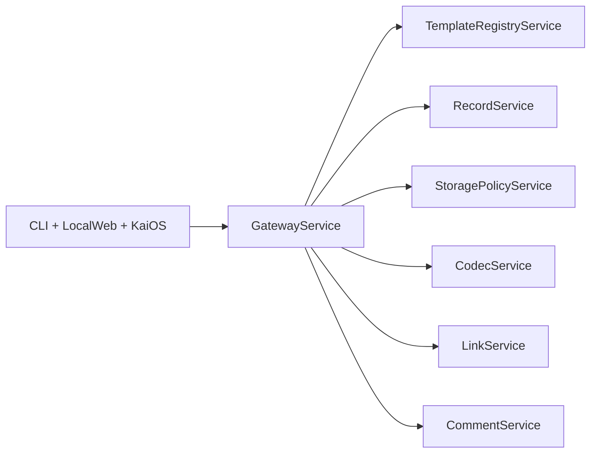

# Modules

## Architecture Goal

Keep implementation simple in each service while maintaining deployable boundaries from day one.

## Service Graph

## Contracts

- `gateway-service`: `architecture/services/gateway-service.md`
- `template-registry-service`: `architecture/services/template-registry-service.md`
- `record-service`: `architecture/services/record-service.md`
- `storage-policy-service`: `architecture/services/storage-policy-service.md`
- `codec-service`: `architecture/services/codec-service.md`
- `link-service`: `architecture/services/link-service.md`
- `comment-service`: `architecture/services/comment-service.md`

## Shared Interface Rules

- JSON over HTTP for service-to-service calls.
- Stable error envelopes:
  - `code`
  - `message`
  - `details` (optional)
- Version every public route under `/v1`.
- No client performs codec/template logic directly; route through gateway.

## Deployment Notes

- Local dev can run all services on localhost with separate ports.
- CLI, browser app, and KaiOS app consume only gateway endpoints where possible.
- Services may be bundled in one process for constrained devices, but contracts remain unchanged.

